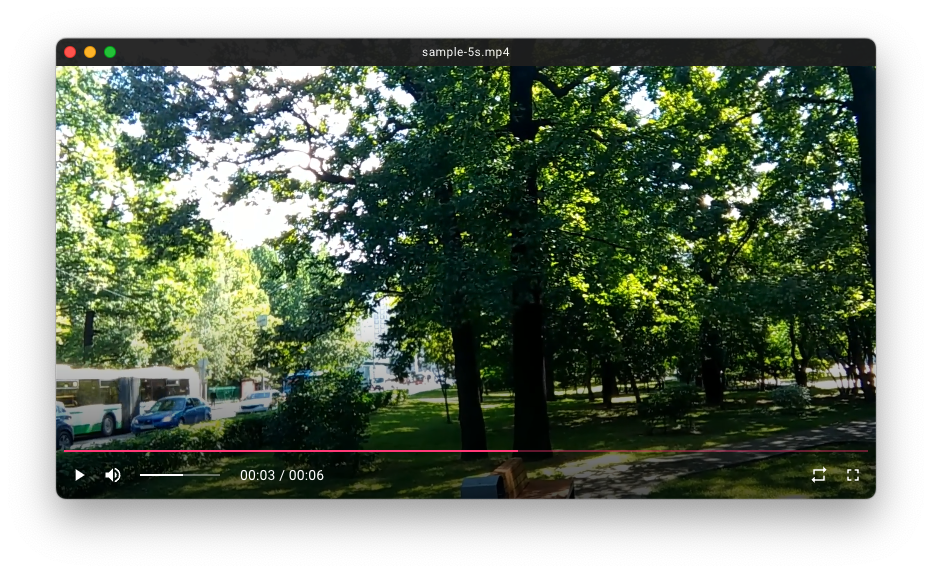

# Visty

[](https://github.com/fiahfy/visty/actions/workflows/create-release.yml)

> Simple Video Player based on Electron.

## Features

- Cross-Platform Compatibility

## TODOs

- [ ] Rotate/Flip
- [ ] Subtitles
- [ ] Autoplay Next Video
- [ ] Show thumbnail on seek bar and previous/next track buttons

## Screenshots



## Installation

Download the app from [release page](https://github.com/fiahfy/visty/releases) and install it.  
:warning: For macOS, this app is not signed, so a warning will be displayed at startup.

## Development

```bash
# install dependencies
yarn

# serve with hot reload
yarn dev
```

## References

- https://github.com/electron/forge/tree/main/packages/external/create-electron-app
- https://github.com/electron-vite/create-electron-vite
- https://github.com/vitejs/vite/tree/main/packages/create-vite/template-react-ts
- https://github.com/mui/material-ui/tree/master/examples/material-ui-vite-ts
